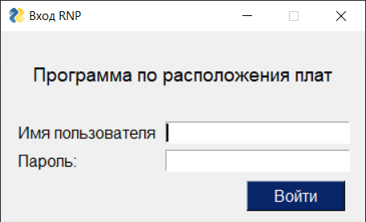
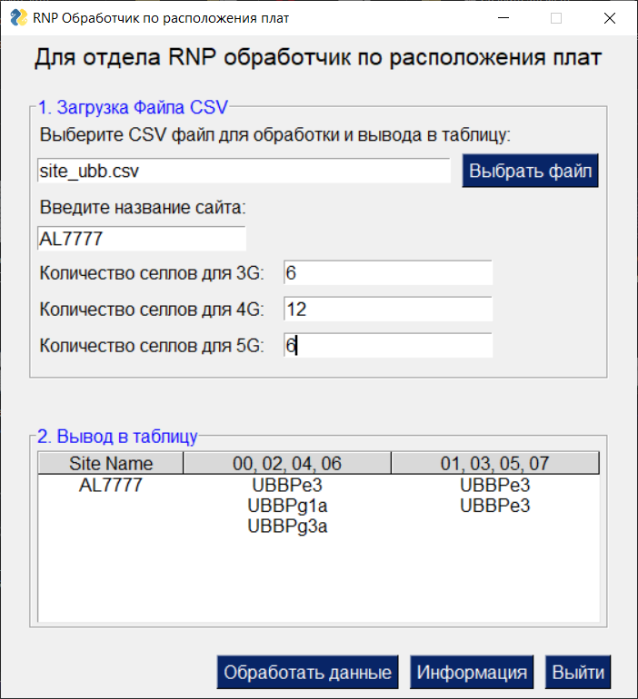

<!-- PROJECT LOGO -->

  <h2 align="center">Search UBB Boards</h2>
  <h3 align="center">Разработан графический интерфейс для отдела RNP по запросу от коллеги с помощью запроса chatGPT</h3>
  <h4 align="center">С помощью библиотек PySimpleGUI, pandas, csv, os </h4>
     
    <a href="Запрос в chatGPT.txt"><strong>request ChatGPT »</strong></a>
    ·
    <a href="search_ubb.py"><strong>File Python »</strong></a>
     
      
     
 Окно входа

     
     
     
    
Главное окно

    

